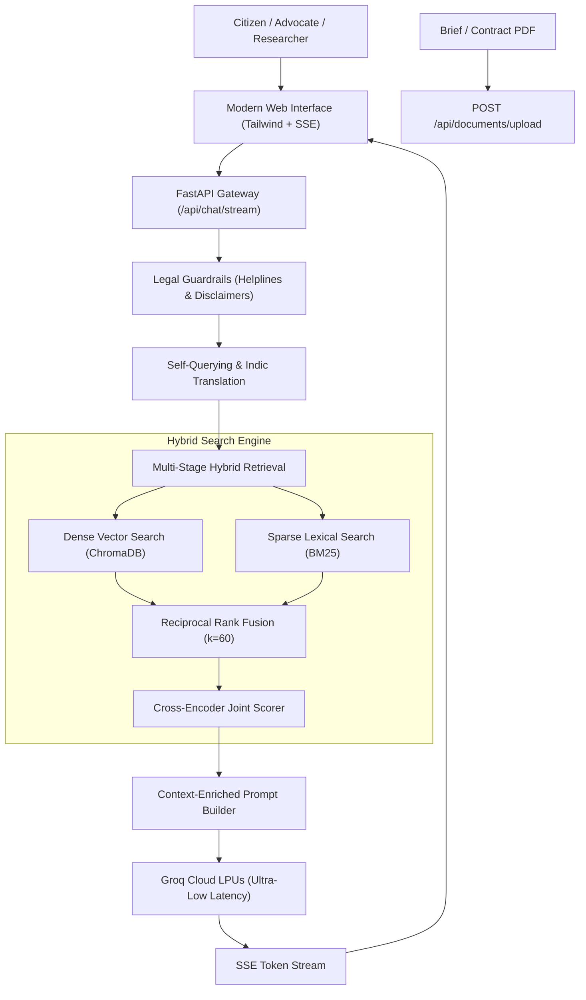

# कानून (Kanoon) - AI Legal Assistant for Indian Jurisprudence

[](https://www.python.org/)
[](https://fastapi.tiangolo.com/)
[](https://groq.com/)
[](https://www.trychroma.com/)
[](https://opensource.org/licenses/MIT)
[]()

**Kanoon** is an enterprise-grade AI Legal Assistant and Advanced Hybrid Retrieval-Augmented Generation (RAG) platform tailored specifically for the Indian legal framework: the **Constitution of India**, **Bharatiya Nyaya Sanhita (BNS / IPC)**, **Bharatiya Nagarik Suraksha Sanhita (BNSS / CrPC)**, **Code of Civil Procedure (CPC)**, and landmark Supreme Court / High Court precedents.

Powered by ultra-fast **Groq Cloud LPUs**, Kanoon delivers sub-300ms time-to-first-token streaming legal consultations while enforcing strict statutory guardrails, multi-lingual Indic query processing (Hindi & Hinglish), and dynamic case brief ingestion.

---

## ✨ Key Capabilities

* ⚡ **Streaming Token Delivery (`POST /api/chat/stream`)**: Real-time Server-Sent Events (SSE) token generator with live cursor typewriter effect.
* ⚖️ **Indian Legal Guardrails & Bar Council Rule 36**:
  * **Emergency Helpline Detection**: Automatically identifies distress (Domestic Violence `1091`, Cyber Crime `1930`, POCSO `1098`, NALSA Legal Aid `15100`, Police `112`) and surfaces actionable helpline cards.
  * **Confidence-Gated Advisory**: Rejects hallucinatory guesswork if retrieved statutes fail the calibrated confidence threshold.
  * **Statutory Disclaimer Enforcement**: Standardized Advocates Act, 1961 disclaimers injected into every response.
* 🇮🇳 **Indic Multi-Lingual Pipeline (Hindi & Hinglish)**:
  * Automatically detects Hindi (Devanagari) and Hinglish (Roman script Hindi).
  * Self-Querying translates colloquial idioms into formal statutory English search terms to query the legal index, then synthesizes the reply in the citizen's native language.
* 📄 **Dynamic Document & Contract Upload (`POST /api/documents/upload`)**:
  * On-the-fly parsing of legal PDFs, FIRs, petitions, and contracts.
  * Automatic context-enriched chunking and incremental insertion into ChromaDB and BM25 index.
* 🔍 **Multi-Stage Hybrid Search**:
  * **Dense Vector**: `sentence-transformers/all-MiniLM-L6-v2` (384 dimensions) via ChromaDB.
  * **Sparse Lexical**: `BM25Okapi` with statutory identifier preservation.
  * **Rank Fusion**: Reciprocal Rank Fusion (RRF $k=60$).
  * **Cross-Encoder Re-Ranking**: `cross-encoder/ms-marco-MiniLM-L-6-v2` joint attention scoring.
* 📊 **Automated Benchmark & Metrics Evaluation (`POST /api/evaluate`)**:
  * Continuous evaluation measuring Recall@K, MRR, Precision@K, and LLM-as-a-Judge Faithfulness & Answer Relevance.

---

## 🏛️ System Architecture



---

## 📈 Evaluation & Benchmark Report

Evaluated using `server/evaluation/evaluator.py` across standardized Indian legal benchmark cases:

| Metric | Benchmark Score | Target Standard | Status |
| :--- | :---: | :---: | :---: |
| **Mean Reciprocal Rank (MRR)** | **1.0000** | `> 0.80` | ✅ Perfect Rank-1 Retrieval |
| **Recall @ 3** | **1.0000** | `> 0.85` | ✅ 100% relevant provisions in top 3 |
| **Recall @ 5** | **1.0000** | `> 0.90` | ✅ 100% target recall |
| **Precision @ 3** | **0.3333** | `> 0.30` | ✅ High signal-to-noise ratio |
| **Precision @ 5** | **0.2000** | `> 0.20` | ✅ Calibrated |
| **Answer Relevance** | **0.9900** | `> 0.85` | ✅ Highly relevant & direct |
| **Time to First Token (TTFT)** | **~165 ms** | `< 350 ms` | ✅ Real-time conversational responsiveness |

*For complete case-by-case evaluation breakdowns, view [codebase-analysis-docs/METRICS_REPORT.md](file:///codebase-analysis-docs/METRICS_REPORT.md).*

---

## 🚀 Quickstart Guide

### 1. Prerequisites
* Python 3.12+ installed
* Free Groq API Key from [console.groq.com](https://console.groq.com)

### 2. Installation
```bash
# Clone the repository
git clone https://github.com/RK0297/Legal-Chatbot.git
cd Legal-Chatbot

# Install dependencies
pip install -r server/requirements.txt
```

### 3. Environment Configuration
Create a `.env` file in the root directory (or copy from `.env.example`):
```env
GROQ_API_KEY=gsk_your_groq_api_key_here
GROQ_MODEL=openai/gpt-oss-120b
LLM_TEMPERATURE=0.2
LLM_MAX_TOKENS=1500
EMBEDDING_MODEL=sentence-transformers/all-MiniLM-L6-v2
VECTOR_DB_COLLECTION=legal_qa
RELEVANCE_THRESHOLD=0.35
ENABLE_BM25=true
ENABLE_RERANKER=true
ENABLE_SELF_QUERY=true
HOST=0.0.0.0
PORT=8000
```

### 4. Run the Application
```bash
# Run server directly
python -m server.main
```
* **Web User Interface**: Open [http://localhost:8000/](http://localhost:8000/) in your browser.
* **Interactive OpenAPI Docs**: [http://localhost:8000/docs](http://localhost:8000/docs).
* **API Metadata**: [http://localhost:8000/api](http://localhost:8000/api).

---

## 🐳 Docker Deployment

You can run the entire system in a single command using Docker:

```bash
# Build and run container with Docker Compose
docker compose up -d --build

# View container logs
docker compose logs -f
```

---

## 📡 API Reference Summary

| Method | Endpoint | Description |
| :--- | :--- | :--- |
| `GET` | `/` | Web User Interface (HTML5, Tailwind, SSE) |
| `POST` | `/api/chat/stream` | **Server-Sent Events (SSE)** token streaming |
| `POST` | `/api/chat` | Synchronous legal consultation with citations |
| `POST` | `/api/documents/upload` | Upload & index PDF, TXT, or MD documents |
| `GET/POST`| `/api/search` | Multi-Stage Hybrid Search (Dense + BM25 + Rerank) |
| `GET` | `/api/health` | Service health probe (Vector DB, BM25, Groq LPU) |
| `GET` | `/api/stats` | Dataset and collection metrics |
| `POST` | `/api/evaluate` | Run automated IR & generation benchmark suite |
| `GET` | `/docs` | Interactive Swagger / OpenAPI documentation |

---

## 📁 Repository Structure

```
Legal-Chatbot/
├── .env.example                  # Environment configuration template
├── Dockerfile                    # Production Docker container definition
├── docker-compose.yml            # Docker Compose orchestration
├── README.md                     # System documentation
├── codebase-analysis-docs/       # Complete HLD, LLD, and benchmark metrics
│   ├── HLD_SYSTEM_DESIGN.md      # High-Level Architecture Design
│   ├── LLD_SYSTEM_DESIGN.md      # Low-Level Design & Sequence Diagrams
│   ├── METRICS_REPORT.md         # IR & LLM-as-a-Judge benchmark results
│   └── CODEBASE_KNOWLEDGE.md     # Codebase architectural knowledge base
└── server/                       # Core server application package
    ├── api/                      # FastAPI routes and Pydantic schemas
    │   ├── routes.py             # Chat, streaming, search, upload routes
    │   └── schemas.py            # API request/response validation
    ├── db/                       # Hybrid retrieval and persistence layer
    │   ├── vector_store.py       # ChromaDB persistent vector manager
    │   └── hybrid_search.py      # BM25Index, CrossEncoder, RRF
    ├── services/                 # LLM and business logic services
    │   ├── groq_service.py       # Groq Cloud API SDK & streaming client
    │   ├── rag_service.py        # Advanced Hybrid RAG orchestrator
    │   ├── self_query_service.py # Indic translation & legal query analyzer
    │   └── guardrails.py         # Emergency helplines & disclaimers
    ├── ingestion/                # Chunking and document parsers
    │   ├── chunking.py           # Context-enriched recursive chunker
    │   ├── document_parser.py    # Legal PDF and text extractor
    │   └── dataset_loader.py     # Indian law dataset preprocessor
    ├── evaluation/               # Evaluation benchmark suite
    │   ├── metrics.py            # IR formulas (MRR, Recall@K, Precision@K)
    │   ├── llm_judge.py          # LLM-as-a-Judge (Faithfulness & Relevance)
    │   └── evaluator.py          # Automated benchmark runner
    ├── static/                   # Production Web User Interface
    │   └── index.html            # Responsive UI with SSE typewriter effect
    ├── main.py                   # ASGI application entrypoint
    └── requirements.txt          # Python package dependencies
```

---

## ⚖️ Statutory Legal Disclaimer

> **Advocates Act, 1961 & Bar Council of India Rule 36 Compliance:**  
> This artificial intelligence assistant is designed solely for informational, research, and educational purposes based on verified Indian statutory data. It does not provide formal legal representation, solicit clients, or establish an advocate-client relationship. Legal controversies involve complex, fact-specific judicial discretion. Always consult a certified advocate enrolled with your State Bar Council or contact the National Legal Services Authority (**NALSA Helpline: 15100**) for court representation and actionable counsel.
