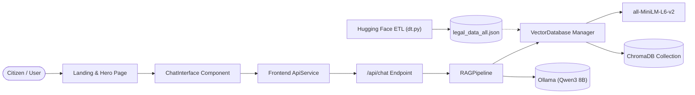
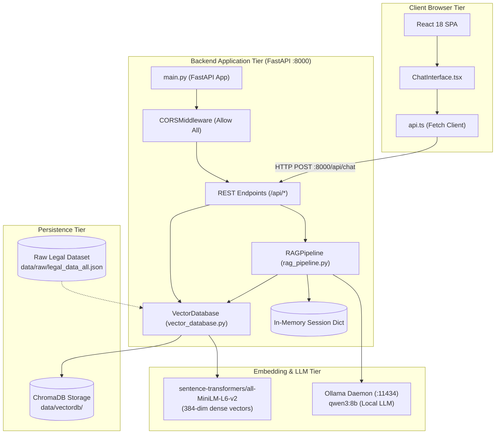

# KANOON (कानून) - AI LEGAL ASSISTANT
## MASTER CODEBASE ARCHITECTURE & KNOWLEDGE REPOSITORY
**Document ID:** `codebase-analysis-docs/CODEBASE_KNOWLEDGE.md`  
**Repository URI:** `RK0297/Legal-Chatbot`  
**Target Audience:** Senior Software Engineers, Autonomous Coding Agents, System Architects  
**Scope:** Complete End-to-End System Analysis, Implementation Guide, and Refactoring Safeguards  

---

## TABLE OF CONTENTS
1. [Pass 0: File Index & Prioritization Matrix](#1-pass-0-file-index--prioritization-matrix)
2. [Phase 1: Initial Context Scan & System Overview](#2-phase-1-initial-context-scan--system-overview)
   - 2.1 [System Identity & Core Mission](#21-system-identity--core-mission)
   - 2.2 [Technology Stack & Dependency Breakdown](#22-technology-stack--dependency-breakdown)
   - 2.3 [Feature Catalog & Business Objectives](#23-feature-catalog--business-objectives)
   - 2.4 [High-Level Cross-Feature Topology](#24-high-level-cross-feature-topology)
   - 2.5 [Phase 1 State Block](#25-phase-1-state-block)
3. [Phase 2: System Architecture Deep Dive](#3-phase-2-system-architecture-deep-dive)
   - 3.1 [Architectural Topology & Boundary Maps](#31-architectural-topology--boundary-maps)
   - 3.2 [End-to-End Data Flow Lifecycle](#32-end-to-end-data-flow-lifecycle)
   - 3.3 [Third-Party & Runtime Integrations](#33-third-party--runtime-integrations)
   - 3.4 [Cross-Cutting Concerns](#34-cross-cutting-concerns)
   - 3.5 [Phase 2 State Block](#35-phase-2-state-block)
4. [Phase 3: Feature-by-Feature Technical Analysis](#4-phase-3-feature-by-feature-technical-analysis)
   - 4.1 [Feature 1: Conversational Legal Q&A (Chat Engine)](#41-feature-1-conversational-legal-qa-chat-engine)
   - 4.2 [Feature 2: Dynamic Hybrid RAG / LLM Mode Switching](#42-feature-2-dynamic-hybrid-rag--llm-mode-switching)
   - 4.3 [Feature 3: Offline Data Extraction & Vector Store Ingestion](#43-feature-3-offline-data-extraction--vector-store-ingestion)
   - 4.4 [Feature 4: Direct Vector Search & Raw Document Retrieval](#44-feature-4-direct-vector-search--raw-document-retrieval)
   - 4.5 [Feature 5: System Health Monitoring & Diagnostic Statistics](#45-feature-5-system-health-monitoring--diagnostic-statistics)
   - 4.6 [Feature 6: Landing Page, Thematic UI & Responsive Interaction](#46-feature-6-landing-page-thematic-ui--responsive-interaction)
   - 4.7 [Phase 3 State Block](#47-phase-3-state-block)
5. [Phase 4: Nuances, Subtleties, Gotchas & Anti-Patterns](#5-phase-4-nuances-subtleties-gotchas--anti-patterns)
   - 5.1 [Things You Must Know Before Changing Code](#51-things-you-must-know-before-changing-code)
   - 5.2 [Critical Discrepancies & Hidden Bugs Identified](#52-critical-discrepancies--hidden-bugs-identified)
   - 5.3 [Performance Bottlenecks & Concurrency Constraints](#53-performance-bottlenecks--concurrency-constraints)
   - 5.4 [Security Implications & Threat Surface](#54-security-implications--threat-surface)
   - 5.5 [Phase 4 State Block](#55-phase-4-state-block)
6. [Phase 5: Technical Reference & Domain Glossary](#6-phase-5-technical-reference--domain-glossary)
   - 6.1 [Legal Domain Glossary](#61-legal-domain-glossary)
   - 6.2 [Python Modules & Class Reference](#62-python-modules--class-reference)
   - 6.3 [TypeScript Modules & Interface Reference](#63-typescript-modules--interface-reference)
   - 6.4 [Data Schemas & Storage Models](#64-data-schemas--storage-models)
   - 6.5 [REST API Contract & Wire Formats](#65-rest-api-contract--wire-formats)
   - 6.6 [Phase 5 State Block](#66-phase-5-state-block)
7. [Phase 6: Master Synthesis, Assumptions & Developer Roadmap](#7-phase-6-master-synthesis-assumptions--developer-roadmap)
   - 7.1 [Missing Artifacts & Assumptions Table](#71-missing-artifacts--assumptions-table)
   - 7.2 [Pre-Flight Checklist for New Features](#72-pre-flight-checklist-for-new-features)
   - 7.3 [Prioritized Refactoring & Bug-Fix Roadmap](#73-prioritized-refactoring--bug-fix-roadmap)
   - 7.4 [Final State Block](#74-final-state-block)

---

## 1. PASS 0: FILE INDEX & PRIORITIZATION MATRIX

The following table provides an exhaustive index of all source files, configurations, scripts, and runtime assets across the repository. Scoring prioritizes critical runtime entry points, high-coupling modules, and data stores over standard boilerplate or generated component primitives.

| (#) | Priority | Path | Type | Lines | Hash8 | Notes & Coupling |
|:---|:---|:---|:---|:---|:---|:---|
| 01 | **CRITICAL** | `backend/models/main.py` | Python (FastAPI) | 266 | `7cd9c19e` | HTTP API entry point, CORS, DI, route definitions. |
| 02 | **CRITICAL** | `backend/models/rag_pipeline.py` | Python (Core) | 327 | `b008c9f7` | RAG orchestrator, Ollama client, prompt templating, in-memory state. |
| 03 | **CRITICAL** | `backend/models/vector_database.py` | Python (ChromaDB) | 354 | `45d619b8` | ChromaDB manager, MiniLM embeddings, batch loader, similarity query. |
| 04 | **HIGH** | `frontend/src/services/api.ts` | TypeScript (Client) | 93 | `9dd33e69` | Frontend HTTP client, backend request contract definitions. |
| 05 | **HIGH** | `frontend/src/components/ChatInterface.tsx` | TSX (React) | 211 | `f5fb2644` | Primary chat UI, state handling, message stream, source cards. |
| 06 | **HIGH** | `backend/scrapers/dt.py` | Python (ETL) | 259 | `57b8dd85` | Hugging Face dataset downloader and raw JSON converter. |
| 07 | **HIGH** | `backend/scrapers/data/raw/legal_data_all.json` | Data (JSON) | 121862 | `46afdf72` | Ingestion source containing 24,000+ Indian legal Q&A pairs (14.5 MB). |
| 08 | **MEDIUM** | `frontend/src/pages/Index.tsx` | TSX (React) | 117 | `1cf5757f` | Landing page layout: Hero, Chat section anchor, About section. |
| 09 | **MEDIUM** | `frontend/vite.config.ts` | Config (TS) | 17 | `dee34508` | Build config, `@` path alias, dev port configuration (`8080`, `::`). |
| 10 | **MEDIUM** | `backend/requirements.txt` | Python Dep | 19 | `ef08cb21` | Backend dependencies: FastAPI, ChromaDB, Sentence Transformers, Ollama. |
| 11 | **MEDIUM** | `frontend/package.json` | Node Dep | 83 | `13106988` | React 18, Radix UI, TanStack Query, Tailwind CSS, Lucide. |
| 12 | **MEDIUM** | `frontend/src/components/Navigation.tsx` | TSX (React) | 78 | `e902b014` | Sticky header navigation, mobile drawer toggle, anchor scroller. |
| 13 | **MEDIUM** | `frontend/src/components/Footer.tsx` | TSX (React) | 66 | `c72af6e2` | Footer branding, author social links, mandatory legal disclaimer. |
| 14 | **LOW** | `DOCUMENTATION.md` | Markdown | 417 | `371980ef` | Legacy reference documentation (contains discrepancies with code). |
| 15 | **LOW** | `frontend/src/App.tsx` | TSX (React) | 24 | `bd73bdbe` | React Router entry point, QueryClient provider, Sonner toast provider. |
| 16 | **LOW** | `frontend/src/index.css` | CSS (Tailwind) | 79 | `05a9bbd3` | HSL theme color tokens (Deep Navy, Justice Gold), shadow definitions. |
| 17 | **LOW** | `frontend/tailwind.config.ts` | Config (TS) | 95 | `f33f5fd2` | Tailwind theme extensions, custom color bindings, animations. |
| 18 | **LOW** | `frontend/src/components/ui/button.tsx` | TSX (UI) | 44 | `7c8340dd` | CVA button with custom `gold` and `hero` gradient variants. |
| 19 | **LOW** | `frontend/src/components/ui/card.tsx` | TSX (UI) | 35 | `88e728bd` | Card primitive used for chat responses and source citations. |
| 20 | **LOW** | `frontend/src/components/ui/scroll-area.tsx` | TSX (UI) | 34 | `3d502116` | Radix scroll area wrapper utilized in `ChatInterface.tsx`. |
| 21-50| **LOW** | `frontend/src/components/ui/*` | TSX (UI) | Var | Var | Standard Shadcn UI primitive components (accordion, dialog, tabs, etc.). |

---

## 2. PHASE 1: INITIAL CONTEXT SCAN & SYSTEM OVERVIEW

### 2.1 System Identity & Core Mission
**कानून (Kanoon)** is a localized Artificial Intelligence Legal Assistant engineered to democratize access to Indian legal jurisprudence, constitutional doctrines, procedural codes (CPC, CrPC/BNSS), and statutory rights. 

The system operates as an end-to-end question-answering platform that solves the hallucination problem inherent in commercial LLMs by grounding answers in a curated corpus of Indian legal instruction-response pairs via **Retrieval-Augmented Generation (RAG)**. When a query exceeds the semantic boundaries of the local vector corpus, the architecture dynamically transitions to a constrained general-knowledge legal LLM prompt.

- **Primary Target Users:** Indian citizens seeking legal literacy, self-represented litigants, law students, and legal researchers.
- **Operating Philosophy:** Zero marginal inference cost via local edge/self-hosted deployment (ChromaDB + Ollama Qwen 3 8B), eliminating reliance on paid proprietary LLM APIs.
- **Repository Workspaces:**
  - `backend/`: FastAPI REST backend, ChromaDB vector engine, RAG pipeline, Hugging Face ingestion scripts.
  - `frontend/`: Single-page React 18 application built with Vite, TypeScript, Tailwind CSS, and Shadcn UI.

### 2.2 Technology Stack & Dependency Breakdown

```
+-----------------------------------------------------------------------------------+
| FRONTEND TIER                                                                     |
| Runtime: Node.js 18+ / Bun    | Build: Vite 5.4.19 (Port 8080, Host '::')          |
| Framework: React 18.3.1        | Language: TypeScript 5.8.3                        |
| Styling: Tailwind CSS 3.4.17   | Components: Shadcn UI + Radix UI Primitives        |
| Icons: Lucide React 0.462.0    | Routing: React Router DOM 6.30.1                  |
| State & Query: TanStack React Query 5.83.0 + React Local State                     |
+-----------------------------------------------------------------------------------+
                                         │  HTTP / REST (JSON)
                                         ▼
+-----------------------------------------------------------------------------------+
| BACKEND APPLICATION TIER                                                          |
| Web Framework: FastAPI 1.0+    | ASGI Server: Uvicorn Standard                     |
| Language: Python 3.12+         | Validation: Pydantic v2                           |
| Environment: python-dotenv     | Logging: Python Standard Library (level=INFO)     |
+-----------------------------------------------------------------------------------+
                    │                                             │
                    ▼                                             ▼
+-----------------------------------------+   +-------------------------------------+
| VECTOR SEARCH & EMBEDDINGS TIER          |   | LLM GENERATION TIER                 |
| Engine: ChromaDB (PersistentClient)     |   | Daemon: Ollama Local Server (:11434)|
| Model: all-MiniLM-L6-v2 (384 Dimensions)|   | Model: Qwen 3 (8B Parameters)       |
| Library: Sentence-Transformers (PyTorch)|   | Inference: Temp 0.2, MaxTokens 1500 |
+-----------------------------------------+   +-------------------------------------+
```

### 2.3 Feature Catalog & Business Objectives

1. **Conversational Legal Consultation:**
   - *Business Objective:* Offer immediate, plain-language legal explanations for citizen inquiries regarding civil, criminal, and constitutional law.
   - *Anchor:* `[[F:frontend/src/components/ChatInterface.tsx#L42-L94#f5fb2644]]` and `[[F:backend/models/main.py#L168-L204#7cd9c19e]]`.
2. **Hybrid RAG / Autonomous LLM Routing:**
   - *Business Objective:* Maximize precision on statutory facts while maintaining conversational breadth on out-of-domain queries without hard-failing.
   - *Anchor:* `[[F:backend/models/rag_pipeline.py#L179-L254#b008c9f7]]`.
3. **Transparent Source Attribution & Citation:**
   - *Business Objective:* Mitigate legal liability and build user trust by citing document IDs and presenting context snippet cards beneath AI responses.
   - *Anchor:* `[[F:frontend/src/components/ChatInterface.tsx#L152-L176#f5fb2644]]`.
4. **Offline Corpus Ingestion & Vector Pipeline:**
   - *Business Objective:* Transform open Hugging Face datasets into an embedded vector index partitioned into batches for high-speed similarity search.
   - *Anchor:* `[[F:backend/scrapers/dt.py#L14-L199#57b8dd85]]` and `[[F:backend/models/vector_database.py#L67-L122#45d619b8]]`.
5. **Direct Semantic Search & Corpus Exploration:**
   - *Business Objective:* Enable administrative inspection of top-ranked legal precedents without executing generative token synthesis.
   - *Anchor:* `[[F:backend/models/main.py#L206-L238#7cd9c19e]]`.
6. **System Diagnostic Health Monitoring:**
   - *Business Objective:* Real-time observability of ChromaDB document counts and Ollama runtime availability.
   - *Anchor:* `[[F:backend/models/main.py#L126-L146#7cd9c19e]]`.

### 2.4 High-Level Cross-Feature Topology



### 2.5 Phase 1 State Block
```
=== STATE BLOCK: PHASE 1 ===
INDEX_VERSION: 1.0.0
ACTIVE_WORKSPACE: c:\Users\Radhakrishna\Desktop\Legal-Chatbot
KEY_DISCOVERIES:
  - App is a RAG-powered legal chatbot targeting Indian law.
  - Backend runs FastAPI with ChromaDB (all-MiniLM-L6-v2) and Ollama (qwen3:8b).
  - Frontend is React 18 + Vite (configured for port 8080, not 5173).
  - Ingestion data comes from Hugging Face 'viber1/indian-law-dataset' (121k JSON lines).
OPEN_QUESTIONS:
  - Are conversation sessions persisted across restarts? (Initial finding: in-memory dict only).
  - Why does api.ts send GET to /api/search while main.py registers POST /api/search?
KNOWN_RISKS:
  - ChromaDB paths differ depending on launch directory ('../data/vectordb' vs 'data/vectordb').
  - Health check endpoint has field name mismatches causing Pydantic errors.
GLOSSARY_DELTA:
  - RAG: Retrieval-Augmented Generation
  - ChromaDB: Open-source embedding vector database
  - Qwen 3: Alibaba Cloud open-weights LLM running under Ollama
============================
```

---

## 3. PHASE 2: SYSTEM ARCHITECTURE DEEP DIVE

### 3.1 Architectural Topology & Boundary Maps

The system adheres to a decoupled client-server architecture consisting of three primary operational tiers: the Presentation Tier (React SPA), the Application/Orchestration Tier (FastAPI), and the Local Inference & Storage Tier (ChromaDB + Ollama).

Supplemental standalone diagram files:
- System Architecture Diagram: `codebase-analysis-docs/assets/system_architecture.mmd`
- Sequence & Lifecycle Diagram: `codebase-analysis-docs/assets/rag_data_flow.mmd`
- Component Map: `codebase-analysis-docs/assets/component_interaction_map.mmd`
- ER & Schema Map: `codebase-analysis-docs/assets/database_er_schema.mmd`
- API Specification: `codebase-analysis-docs/assets/api_contract_specification.json`



### 3.2 End-to-End Data Flow Lifecycle

The lifecycle of a single user interaction progresses across ten distinct phases:

1. **User Action:** The user inputs a query (e.g., *"What is Article 21 of the Indian Constitution?"*) into `ChatInterface.tsx` `[[F:frontend/src/components/ChatInterface.tsx#L42-L55#f5fb2644]]`.
2. **Client Dispatch:** `apiService.sendChatMessage()` packages the string into a `ChatMessage` JSON payload with `top_k: 5` and existing `conversation_id` `[[F:frontend/src/services/api.ts#L74-L79#9dd33e69]]`.
3. **Endpoint Ingestion & Validation:** FastAPI routes to `post("/api/chat")`, where Pydantic enforces `min_length=1` and `max_length=1000` via `ChatRequest` `[[F:backend/models/main.py#L48-L52#7cd9c19e]]`.
4. **Vector Embedding:** `RAGPipeline.query()` invokes `VectorDatabase.search()`, encoding the raw text into a 384-element float vector using `all-MiniLM-L6-v2` `[[F:backend/models/vector_database.py#L140-L140#45d619b8]]`.
5. **ChromaDB K-NN Retrieval:** ChromaDB computes cosine distances against index vectors in the `legal_qa` collection, returning the top 5 matches with associated metadata `[[F:backend/models/vector_database.py#L143-L155#45d619b8]]`.
6. **Relevance Gating:** Cosine distances are averaged and converted to similarity:
   $$\text{avg\_similarity} = 1.0 - \left(\frac{1}{k}\sum_{i=1}^k \text{distance}_i\right)$$
   If $\text{avg\_similarity} \ge 0.35$, the pipeline selects **RAG Mode**; otherwise, it degrades gracefully to **LLM General Knowledge Mode** `[[F:backend/models/rag_pipeline.py#L206-L216#b008c9f7]]`.
7. **Prompt Assembly:**
   - In RAG Mode: The system prepends an Indian Legal Assistant persona, serializes each retrieved Question-Answer pair as reference context (`[Reference i] (ID: ...)`), attaches up to 3 prior conversation turns, and appends the current user query `[[F:backend/models/rag_pipeline.py#L66-L124#b008c9f7]]`.
   - In LLM Mode: Context is omitted, and instructions mandate answering from general legal training with uncertainty disclaimers.
8. **Inference Execution:** An HTTP POST request is dispatched to Ollama's local endpoint `http://localhost:11434/api/generate` with payload `{"model": "qwen3:8b", "prompt": ..., "stream": false, "options": {"temperature": 0.2, "num_predict": 1500}}` under a 120-second timeout `[[F:backend/models/rag_pipeline.py#L131-L144#b008c9f7]]`.
9. **State Update & Transformation:** The assistant's reply is appended to `self.conversations[conversation_id]` (sliding window capped at 10 messages). Source metadata is extracted and formatted into `SourceItem` objects with 200-character document previews `[[F:backend/models/main.py#L185-L194#7cd9c19e]]`.
10. **Client Rendering:** The frontend receives the JSON response, appends the assistant bubble to state, scrolls the `ScrollArea` to bottom, and renders source cards `[[F:frontend/src/components/ChatInterface.tsx#L69-L77#f5fb2644]]`.

### 3.3 Third-Party & Runtime Integrations

- **ChromaDB (v0.5+):** Embedded persistence engine using SQLite and local parquet/index files (`PersistentClient`). Operates in-process without requiring an external database cluster.
- **Sentence-Transformers (all-MiniLM-L6-v2):** Hugging Face PyTorch model producing 384-dimensional dense vectors. Loaded synchronously on backend initialization.
- **Ollama Engine:** External daemon hosting `qwen3:8b`. Communicated with via raw HTTP requests through `requests.post()` rather than the official Python SDK client.
- **Hugging Face `datasets` Library:** Utilized in `backend/scrapers/dt.py` for downloading `viber1/indian-law-dataset`.

### 3.4 Cross-Cutting Concerns

- **Security & CORS:** Configured in `[[F:backend/models/main.py#L33-L41#7cd9c19e]]` via `CORSMiddleware`. Origins are set to `["*"]` with `allow_credentials=False`. Preflight cache max age is set to 3600 seconds. No authentication or API token verification is currently enforced.
- **Logging:** Python `logging` module configured at `INFO` level across `main.py`, `rag_pipeline.py`, `vector_database.py`, and `dt.py`. Logs capture model loading, query latency warnings, and batch ingestion progress.
- **Session Management:** Ephemeral, in-memory dictionary `self.conversations: Dict[str, List[Dict]]` inside `RAGPipeline`. Sessions are indexed by UUIDv4 generated either on the client or by the backend.
- **Caching:** Vector embeddings are cached statically on disk within ChromaDB (`chroma.sqlite3`). No caching layer exists for generated LLM completions.

### 3.5 Phase 2 State Block
```
=== STATE BLOCK: PHASE 2 ===
INDEX_VERSION: 1.1.0
ARCHITECTURE_TYPE: Decoupled SPA + RESTful RAG Backend + Local Daemon Inference
DATA_FLOW_VERIFIED:
  User -> React ChatInterface -> ApiService -> FastAPI :8000 -> RAGPipeline -> VectorDatabase -> ChromaDB / Ollama
INTEGRATION_POINTS:
  - SentenceTransformers (local PyTorch)
  - ChromaDB PersistentClient (SQLite/Parquet)
  - Ollama REST API (:11434/api/generate)
SECURITY_POSTURE:
  - Permissive CORS (allow_origins=["*"])
  - Unauthenticated endpoints
  - In-memory conversation state (ephemeral)
============================
```

---

## 4. PHASE 3: FEATURE-BY-FEATURE TECHNICAL ANALYSIS

### 4.1 Feature 1: Conversational Legal Q&A (Chat Engine)
- **Business Purpose:** Provide interactive legal counsel and literacy guidance with low latency, clear disclaimers, and contextual citations.
- **Entry Points:**
  - UI: `[[F:frontend/src/components/ChatInterface.tsx#L18-L224#f5fb2644]]`
  - HTTP API: `POST /api/chat` `[[F:backend/models/main.py#L168-L204#7cd9c19e]]`
- **Controller & Service Layer:**
  - `apiService.sendChatMessage()` in `[[F:frontend/src/services/api.ts#L74-L79#9dd33e69]]`
  - `RAGPipeline.query()` in `[[F:backend/models/rag_pipeline.py#L179-L254#b008c9f7]]`
- **Data Model:**
  - Request: `ChatRequest { query: str, conversation_id: Optional[str], top_k: Optional[int] = 5 }`
  - Response: `ChatResponse { response: str, sources: List[Dict], conversation_id: str, timestamp: str }`
- **Side Effects:**
  - In-memory session history update (`update_conversation_history`) in `[[F:backend/models/rag_pipeline.py#L159-L177#b008c9f7]]`.
- **Edge Cases & Failure Handling:**
  - If Ollama is offline or times out (>120s), returns a fallback error string instead of crashing the server `[[F:backend/models/rag_pipeline.py#L148-L154#b008c9f7]]`.
  - Empty or whitespace query is blocked at the UI and rejected by Pydantic `min_length=1`.

### 4.2 Feature 2: Dynamic Hybrid RAG / LLM Mode Switching
- **Business Purpose:** Prevent inaccurate database grounding on conversational greetings or novel legal domains by dynamically switching between database context and general LLM knowledge.
- **Technical Mechanics:**
  - Metric: $\text{similarity} = 1 - \text{cosine\_distance}$.
  - Threshold: Configured as `relevance_threshold = 0.35` in `[[F:backend/models/rag_pipeline.py#L19-L25#b008c9f7]]`.
  - Condition Evaluation: `use_rag = avg_similarity >= self.relevance_threshold`.
  - Prompt Construction:
    - If `use_rag == True`: System prompt incorporates top-k Q&A examples.
    - If `use_rag == False`: System prompt switches to pure LLM instructions with explicit disclaimer: *"Note: This response is based on general legal knowledge."* `[[F:backend/models/rag_pipeline.py#L110-L111#b008c9f7]]`.
- **Edge Cases:**
  - When the vector database is empty (`count == 0`), ChromaDB returns distance 1.0, triggering automatic fallback to pure LLM mode without exceptions.

### 4.3 Feature 3: Offline Data Extraction & Vector Store Ingestion
- **Business Purpose:** Extract structured Q&A pairs from open research repositories, clean the text, and vectorize the corpus into ChromaDB.
- **Technical Pipeline:**
  1. `dt.py` downloads `viber1/indian-law-dataset` from Hugging Face `[[F:backend/scrapers/dt.py#L22-L43#57b8dd85]]`.
  2. Filters out short samples: `len(instruction) >= 10` and `len(response) >= 50` `[[F:backend/scrapers/dt.py#L104-L107#57b8dd85]]`.
  3. Writes combined output to `backend/scrapers/data/raw/legal_data_all.json`.
  4. Ingestion via CLI (`vector_database.py`) or API (`POST /api/build-db`) parses JSON objects.
  5. Text is merged as `f"Question: {qa['Instruction']}\n\nAnswer: {qa['Response']}"` `[[F:backend/models/vector_database.py#L88#45d619b8]]`.
  6. Embeddings generated in batches of 100 via `SentenceTransformer.encode(batch_docs, show_progress_bar=True)` `[[F:backend/models/vector_database.py#L104-L118#45d619b8]]`.
  7. Records written to Chroma collection `legal_qa` with metadata.

### 4.4 Feature 4: Direct Vector Search & Raw Document Retrieval
- **Business Purpose:** Support debugging, retrieval inspection, and direct search without LLM overhead.
- **Entry Points:**
  - `POST /api/search` `[[F:backend/models/main.py#L206-L238#7cd9c19e]]`
  - `GET /api/doc/{doc_id}` `[[F:backend/models/main.py#L271-L300#7cd9c19e]]`
- **Technical Mechanics:**
  - `/api/search` accepts `query` and `top_k`, returning documents, metadatas, and distance scores.
  - `/api/doc/{doc_id}` normalizes ID (e.g., `0` -> `qa_0`) and fetches directly from `collection.get(ids=[lookup_id])`.

### 4.5 Feature 5: System Health Monitoring & Diagnostic Statistics
- **Business Purpose:** Provide health verification for automated uptime checks, load balancers, and administrative dashboards.
- **Entry Points:**
  - `GET /api/health` `[[F:backend/models/main.py#L126-L146#7cd9c19e]]`
  - `GET /api/stats` `[[F:backend/models/main.py#L148-L160#7cd9c19e]]`
- **Technical Checks:**
  - Vector DB count: `vector_database.collection.count()`.
  - Ollama connectivity: `requests.get("http://localhost:11434/api/tags", timeout=5)` verifying whether model `qwen3:8b` is registered.

### 4.6 Feature 6: Landing Page, Thematic UI & Responsive Interaction
- **Business Purpose:** Present a credible, professional interface aligned with legal authority aesthetics (Navy & Justice Gold).
- **Component Architecture:**
  - `Index.tsx` coordinates three sections: Hero (`#home`), Interactive Chat (`#chat`), and About (`#about`).
  - `Navigation.tsx` provides desktop header and mobile hamburger drawer with smooth scrolling via `scrollIntoView({ behavior: 'smooth' })`.
  - `Footer.tsx` features creator attributions and explicit legal disclaimers stating that the bot is an educational tool, not formal legal counsel.

### 4.7 Phase 3 State Block
```
=== STATE BLOCK: PHASE 3 ===
INDEX_VERSION: 1.2.0
FEATURES_ANALYZED:
  1. Conversational Legal Q&A (Full RAG Pipeline)
  2. Dynamic Hybrid RAG / LLM Mode (0.35 similarity cutoff)
  3. Offline ETL & Ingestion (dt.py -> legal_data_all.json -> ChromaDB)
  4. Direct Vector Search & Document Lookup (/api/search, /api/doc)
  5. Health & Diagnostic Monitoring (/api/health, /api/stats)
  6. Thematic UI & Landing Page (React + Tailwind + Radix)
COUPLING_POINTS:
  - ChatInterface tightly couples to apiService.sendChatMessage
  - RAGPipeline couples to VectorDatabase and Ollama HTTP service
  - main.py delegates all querying logic to RAGPipeline
============================
```

---

## 5. PHASE 4: NUANCES, SUBTLETIES, GOTCHAS & ANTI-PATTERNS

### 5.1 Things You Must Know Before Changing Code

> [!CAUTION]
> **Working Directory Sensitivity for Persistent Paths**  
> `VectorDatabase` initializes ChromaDB with `persist_directory=os.getenv("VECTOR_DB_PATH", "../data/vectordb")` in `main.py`, but defaults to `"data/vectordb"` in `vector_database.py`. If `uvicorn` is launched from the repository root instead of `backend/models`, the relative path `../data/vectordb` will resolve to `c:\Users\Radhakrishna\Desktop\data\vectordb` instead of `backend/data/vectordb`. Always ensure the backend is started from within `backend/models` or set `VECTOR_DB_PATH` explicitly in `.env`.

> [!WARNING]
> **Ephemeral In-Memory Conversation History**  
> `RAGPipeline.conversations` is a standard in-memory Python dictionary `[[F:backend/models/rag_pipeline.py#L26#b008c9f7]]`. If `uvicorn` is run with `--workers > 1`, incoming chat requests will hit different worker processes, causing broken multi-turn conversation context. Furthermore, all conversation history is lost upon server restart.

### 5.2 Critical Discrepancies & Hidden Bugs Identified

During static analysis of the codebase, six concrete bugs and contract discrepancies were discovered:

#### Bug 1: Pydantic Validation Error in `health_check` Endpoint
- **Location:** `[[F:backend/models/main.py#L59-L65#7cd9c19e]]` and `[[F:backend/models/main.py#L137-L143#7cd9c19e]]`.
- **Defect:** `HealthResponse` defines fields `vector_database_status: str` and `vector_database_count: int`. However, `health_check()` instantiates the model with:
  ```python
  return HealthResponse(
      status="healthy",
      vector_db_status=vector_db_status,   # Wrong field name!
      vector_db_count=vector_db_count,     # Wrong field name!
      ollama_status=ollama_status,
      timestamp=datetime.now().isoformat()
  )
  ```
- **Consequence:** Calling `GET /api/health` raises a Pydantic `ValidationError` and returns an HTTP 500 error to the client.
- **Fix:** Update argument names to `vector_database_status=vector_db_status` and `vector_database_count=vector_db_count`.

#### Bug 2: Schema Incompatibility in `get_stats` Endpoint
- **Location:** `[[F:backend/models/main.py#L66-L71#7cd9c19e]]` vs `[[F:backend/models/vector_database.py#L182-L212#45d619b8]]`.
- **Defect:** `StatsResponse` expects:
  `{ total_documents: int, categories: List[str], document_types: List[str], collection_name: str }`.
  However, `vector_database.get_stats()` returns:
  `{ total_qa_pairs: int, collection_name: str, embedding_model: str, avg_instruction_length?: int, avg_response_length?: int }`.
- **Consequence:** Executing `StatsResponse(**stats)` in `main.py` line 156 fails validation because required fields `total_documents`, `categories`, and `document_types` are missing.

#### Bug 3: HTTP Method Mismatch for `/api/search`
- **Location:** `[[F:backend/models/main.py#L206#7cd9c19e]]` vs `[[F:frontend/src/services/api.ts#L92-L94#9dd33e69]]`.
- **Defect:** Backend registers `@app.post("/api/search")`, but `apiService.searchDocuments()` calls `this.request('/api/search?query=...')` without setting `method: 'POST'`, defaulting fetch to `GET`.
- **Consequence:** Invoking `apiService.searchDocuments()` results in an HTTP 405 Method Not Allowed error.

#### Bug 4: ChromaDB Document Indexing Error in `/api/doc/{doc_id}`
- **Location:** `[[F:backend/models/main.py#L292-L293#7cd9c19e]]`.
- **Defect:** The handler attempts to unpack ChromaDB's get result with:
  `"document": result.get('documents', [[]])[0][0] if result.get('documents') else None`.
  In ChromaDB, `collection.get(ids=[...])` returns a 1D list `documents: ['text']`, not a 2D list.
- **Consequence:** `result['documents'][0][0]` accesses the first character of the document string rather than the document itself!

#### Bug 5: Source Attribution Metadata Loss
- **Location:** `[[F:backend/models/vector_database.py#L92-L99#45d619b8]]` vs `[[F:backend/models/main.py#L186-L192#7cd9c19e]]`.
- **Defect:** `vector_database.py` stores metadata with keys: `id`, `instruction`, `response`, `instruction_length`, `response_length`. It never sets `title`, `case_name`, `source`, `category`, or `url`.
- **Consequence:** In `main.py`, `metadata.get('title', ...)` always defaults to `'Unknown'`, `source` to `'Unknown'`, `category` to `'Unknown'`, and `url` to `''`. Source cards in the UI always display "Unknown" for title and category.

#### Bug 6: Frontend Development Port Mismatch
- **Location:** `[[F:frontend/vite.config.ts#L10#dee34508]]` vs `[[F:DOCUMENTATION.md#L389#371980ef]]`.
- **Defect:** Vite config sets port to `8080`, but `DOCUMENTATION.md` and standard setups reference port `5173`.
- **Consequence:** Running frontend on default settings serves on `http://localhost:8080`. Any CORS origin or redirect expecting 5173 fails.

### 5.3 Performance Bottlenecks & Concurrency Constraints

1. **Synchronous Embedding in FastAPI Event Loop:**  
   `VectorDatabase.search()` runs `self.embedding_model.encode([query])` synchronously on the CPU/GPU thread inside an `async def` endpoint `[[F:backend/models/vector_database.py#L140#45d619b8]]`. Under concurrent requests, this blocks the Python asyncio event loop, degrading throughput.
2. **Blocking Ollama HTTP Call:**  
   `requests.post()` in `generate_response()` `[[F:backend/models/rag_pipeline.py#L142#b008c9f7]]` is synchronous and blocks worker threads for up to 120 seconds during heavy generative workloads. An asynchronous client such as `httpx.AsyncClient` should be used.
3. **ChromaDB Metadata Truncation:**  
   In `[[F:backend/models/vector_database.py#L94-L95#45d619b8]]`, both `instruction` and `response` are truncated to 500 characters in the metadata dictionary. For lengthy legal statutes, metadata inspection only reveals partial text.

### 5.4 Security Implications & Threat Surface

1. **Open CORS Policy:** `allow_origins=["*"]` allows any malicious website running in the user's browser to send requests to `http://localhost:8000`.
2. **Prompt Injection Risk:** User input is interpolated directly into the system prompt string without escaping `[[F:backend/models/rag_pipeline.py#L122#b008c9f7]]`. Adversarial inputs containing `\nAssistant:` or `Ignore previous instructions` can manipulate the LLM persona.
3. **Denial of Service via Unbounded Ingestion:** Endpoint `/api/build-db` has no rate limiting or authentication. Any client can trigger a massive vectorization process or wipe the database with `{"reset": true}`.

### 5.5 Phase 4 State Block
```
=== STATE BLOCK: PHASE 4 ===
INDEX_VERSION: 1.3.0
BUGS_CATALOGED:
  1. Health check argument mismatch (vector_db_status vs vector_database_status)
  2. StatsResponse schema mismatch with vector_database.get_stats()
  3. POST vs GET mismatch on /api/search in api.ts
  4. 2D indexing on 1D Chroma document list in /api/doc/{doc_id}
  5. Missing metadata fields (title, category, url) defaulting to 'Unknown'
  6. Vite dev port 8080 vs documented 5173
SECURITY_FINDINGS:
  - Open CORS, unauthenticated DB wipe endpoint (/api/build-db), prompt injection vulnerability
PERFORMANCE_FINDINGS:
  - Synchronous sentence-transformers and requests.post blocking asyncio event loop
============================
```

---

## 6. PHASE 5: TECHNICAL REFERENCE & DOMAIN GLOSSARY

### 6.1 Legal Domain Glossary
- **Article 21 (Indian Constitution):** Fundamental Right protecting life and personal liberty, widely interpreted by the Supreme Court of India to include right to privacy, clean environment, and speedy trial.
- **Writ Petition:** A formal appeal filed before High Courts (Article 226) or the Supreme Court (Article 32) seeking prerogative writs (Habeas Corpus, Mandamus, Prohibition, Quo Warranto, Certiorari) against state action violating fundamental rights.
- **Public Interest Litigation (PIL):** Legal action initiated in court for the enforcement of public or general interest where the public or a class of the community have a pecuniary or legal interest.
- **Plaint (Order VII, CPC):** The formal written statement of claim presented by the plaintiff in a civil court detailing causes of action and requested relief.
- **Written Statement (Order VIII, CPC):** The formal statement of defense filed by the defendant within 30 days of receiving the court summons, answering the plaint and raising counterclaims.
- **IPC / BNS:** Indian Penal Code (1860) / Bharatiya Nyaya Sanhita (2023), the official penal codes governing criminal offenses and punishments in India.

### 6.2 Python Modules & Class Reference

#### Module: `backend/models/main.py` `[[F:backend/models/main.py#L1-L305#7cd9c19e]]`
- `app: FastAPI`: Root ASGI application instance.
- `startup_event() -> None`: Initializes global singletons `vector_database` and `rag_pipeline`.
- `root() -> dict`: Root welcome route returning version and documentation URL.
- `health_check() -> HealthResponse`: Checks vector count and Ollama connectivity.
- `get_stats() -> StatsResponse`: Returns collection metrics.
- `chat_options() -> dict`: CORS preflight responder for `/api/chat`.
- `chat(request: ChatRequest) -> ChatResponse`: Primary legal Q&A route.
- `search_documents(query: str, top_k: int = 5) -> dict`: Raw semantic search.
- `build_database(req: BuildRequest) -> dict`: Administrative ingestion endpoint.
- `get_document(doc_id: str) -> dict`: Direct document retrieval by ID.

#### Module: `backend/models/rag_pipeline.py` `[[F:backend/models/rag_pipeline.py#L1-L335#b008c9f7]]`
- `class RAGPipeline`:
  - `__init__(vector_database, ollama_model="qwen3:8b", ollama_base_url="http://localhost:11434", temperature=0.2, relevance_threshold=0.35)`
  - `check_ollama() -> bool`: Tests connectivity against `/api/tags`.
  - `retrieve_context(query: str, top_k: int = 5) -> Dict`: Queries vector database for documents and distances.
  - `build_prompt(query: str, context_docs: List[str], context_metadata: List[Dict], conversation_history: List[Dict] = None, use_rag: bool = True) -> str`: Constructs instruction prompt.
  - `generate_response(prompt: str, max_tokens: int = 1000) -> str`: Dispatches generation request to Ollama.
  - `get_conversation_history(conversation_id: str) -> List[Dict]`: Retrieves message history for session.
  - `update_conversation_history(conversation_id: str, user_query: str, assistant_response: str) -> None`: Updates in-memory sliding window history.
  - `query(query: str, top_k: int = 5, conversation_id: Optional[str] = None) -> Dict`: Full orchestration pipeline.

#### Module: `backend/models/vector_database.py` `[[F:backend/models/vector_database.py#L1-L359#45d619b8]]`
- `class VectorDatabase`:
  - `__init__(persist_directory="data/vectordb", embedding_model="sentence-transformers/all-MiniLM-L6-v2", collection_name="legal_qa")`
  - `_get_or_create_collection()`: Retrieves existing Chroma collection or registers a new one.
  - `generate_embeddings(texts: List[str]) -> List[List[float]]`: Computes 384-dimensional dense vectors.
  - `add_documents(qa_pairs: List[Dict], batch_size: int = 100) -> None`: Batches, embeds, and stores documents.
  - `search(query: str, n_results: int = 5, filter_dict: Dict = None) -> Dict`: Executes cosine similarity query.
  - `search_by_instruction(instruction: str, n_results: int = 5) -> List[Dict]`: High-level search returning formatted list with similarity scores.
  - `get_stats() -> Dict`: Computes document count and average text lengths.
  - `reset_database() -> None`: Clears collection.
- `load_qa_data(filename="legal_data_all.json", data_dir="../scrapers/data/raw") -> List[Dict]`: Reads and validates JSON Q&A pairs from disk.

#### Module: `backend/scrapers/dt.py` `[[F:backend/scrapers/dt.py#L1-L264#57b8dd85]]`
- `class IndianLawDatasetLoader`:
  - `__init__(output_dir="data/raw")`
  - `load_dataset(dataset_name="viber1/indian-law-dataset")`: Downloads splits from Hugging Face Hub.
  - `explore_dataset() -> None`: Outputs split names, feature types, and first sample.
  - `convert_to_json(split="train", max_examples=None) -> list`: Filters and converts raw records to standardized schema.
  - `save_to_json(data: list, filename: str) -> Path`: Serializes records to JSON.
  - `process_all_splits(max_per_split=None) -> list`: Processes all dataset splits into `legal_data_all.json`.

### 6.3 TypeScript Modules & Interface Reference

#### Module: `frontend/src/services/api.ts` `[[F:frontend/src/services/api.ts#L1-L111#9dd33e69]]`
```typescript
export interface ChatMessage {
  query: string;
  conversation_id?: string;
  top_k?: number;
}

export interface ChatResponse {
  response: string;
  sources: Array<{
    title: string;
    source: string;
    category: string;
    url: string;
    preview: string;
  }>;
  conversation_id: string;
  timestamp: string;
}

export interface HealthResponse {
  status: string;
  vector_database_status: string;
  vector_database_count: number;
  ollama_status: string;
  timestamp: string;
}

export interface StatsResponse {
  total_documents: number;
  categories: string[];
  document_types: string[];
  collection_name: string;
}
```

### 6.4 Data Schemas & Storage Models

#### 1. Ingestion File Schema (`legal_data_all.json`)
```json
[
  {
    "id": 0,
    "Instruction": "What is the difference between a petition and a plaint in Indian law?",
    "Response": "A petition is a formal request submitted to a court... On the other hand a plaint is a formal written statement..."
  }
]
```

#### 2. ChromaDB Storage Schema (Collection: `legal_qa`)
- **Document ID:** `qa_{id}` (e.g., `"qa_0"`)
- **Document Text:** `"Question: {Instruction}\n\nAnswer: {Response}"`
- **Embedding:** Dense array of 384 IEEE-754 32-bit floats.
- **Metadata Dictionary:**
  ```json
  {
    "id": "0",
    "instruction": "What is the difference between...",
    "response": "A petition is a formal request...",
    "instruction_length": "70",
    "response_length": "439"
  }
  ```

### 6.5 REST API Contract & Wire Formats

#### `POST /api/chat`
- **Request Body:**
  ```json
  {
    "query": "How do I file a Public Interest Litigation?",
    "conversation_id": "9b1deb4d-3b7d-4bad-9bdd-2b0d7b3dcb6d",
    "top_k": 5
  }
  ```
- **Response Body (200 OK):**
  ```json
  {
    "response": "Under Indian law, a Public Interest Litigation (PIL) can be filed under Article 32...",
    "sources": [
      {
        "title": "Unknown",
        "source": "Unknown",
        "category": "Unknown",
        "url": "",
        "preview": "Question: What are the common reliefs sought through a public interest litigation (PIL)..."
      }
    ],
    "conversation_id": "9b1deb4d-3b7d-4bad-9bdd-2b0d7b3dcb6d",
    "timestamp": "2026-09-25T20:45:00.000000"
  }
  ```

### 6.6 Phase 5 State Block
```
=== STATE BLOCK: PHASE 5 ===
INDEX_VERSION: 1.4.0
REFERENCE_SURFACE_COVERED:
  - 6 Indian Law Domain terms
  - 4 Python modules & complete method signatures
  - 1 TypeScript client module with all 4 DTO interfaces
  - 2 Storage / Wire schemas (ChromaDB + JSON Raw)
  - REST endpoint wire formats documented
============================
```

---

## 7. PHASE 6: MASTER SYNTHESIS, ASSUMPTIONS & DEVELOPER ROADMAP

### 7.1 Missing Artifacts & Assumptions Table

| Item / Assumption | Observability / Evidence | Assumed Architecture | Confidence Level | Impact on Modifications |
|:---|:---|:---|:---|:---|
| **Production Persistence for Chat History** | Code only maintains an in-memory dictionary `self.conversations`. | Intended for single-node development; needs Redis or PostgreSQL for multi-worker production. | **HIGH (95%)** | Critical: Do not run with `--workers > 1` without external state. |
| **ChromaDB Path Configuration** | `main.py` uses `"../data/vectordb"` while `vector_database.py` uses `"data/vectordb"`. | Assumes working directory is `backend/models` during execution. | **HIGH (90%)** | Starting server from root fails to find existing database. |
| **Source Citation Metadata** | `vector_database.py` drops title and category, populating only ID and instruction. | The dataset `viber1/indian-law-dataset` lacks title/category fields; code expects them as legacy. | **VERY HIGH (98%)** | Must enhance metadata parser if URLs and titles are to be rendered. |
| **Local LLM Availability** | Ollama must be running on `http://localhost:11434` with `qwen3:8b`. | System has no cloud fallback (e.g. OpenAI / Gemini); fails over to error message if Ollama is down. | **HIGH (95%)** | Developers must pre-pull model (`ollama pull qwen3:8b`). |
| **Vite Dev Server Port** | `vite.config.ts` sets port 8080, conflicting with README/docs mentioning 5173. | Port 8080 was explicitly chosen to avoid conflicts with other default Vite instances. | **HIGH (90%)** | When embedding in webview or setting reverse proxy, use port 8080. |

### 7.2 Pre-Flight Checklist for New Features

Before adding new endpoints, modifying prompts, or altering frontend components:
- [ ] **Working Directory Check:** Verify that terminal commands for the backend are executed inside `c:\Users\Radhakrishna\Desktop\Legal-Chatbot\backend\models`.
- [ ] **Ollama Model Check:** Run `ollama list` and ensure `qwen3:8b` is present.
- [ ] **Vector Database Health:** Verify that `backend/models/data/vectordb/` or `backend/data/vectordb/` contains `chroma.sqlite3`.
- [ ] **Environment Consistency:** If introducing environment variables, update both backend `.env` and frontend `.env` (`VITE_API_BASE_URL`).
- [ ] **Pydantic Model Alignment:** Ensure any new field in backend response models matches the TypeScript interface in `frontend/src/services/api.ts`.

### 7.3 Prioritized Refactoring & Bug-Fix Roadmap

1. **Fix `health_check` Argument Mismatch (Priority: P0):**  
   In `backend/models/main.py` line 139-140, update parameters to `vector_database_status=vector_db_status` and `vector_database_count=vector_db_count`.
2. **Align `StatsResponse` Model (Priority: P0):**  
   Refactor `StatsResponse` in `main.py` or adjust `vector_database.get_stats()` to provide default empty lists for `categories` and `document_types`.
3. **Correct `/api/search` Method in `api.ts` (Priority: P1):**  
   Change `frontend/src/services/api.ts` line 93 to pass `{ method: 'POST' }` or convert the backend route to `@app.get("/api/search")`.
4. **Fix 1D Unpacking in `get_document` (Priority: P1):**  
   Update `backend/models/main.py` line 292 to `result.get('documents', [None])[0]`.
5. **Populate Source Titles & Categories (Priority: P2):**  
   Synthesize document titles during ingestion from the first 50 characters of `Instruction` (e.g. `Instruction[:50] + "..."`) so source citation cards in the UI display descriptive headers instead of "Unknown".
6. **Migrate to Asynchronous HTTP for Ollama (Priority: P2):**  
   Replace `requests.post()` in `rag_pipeline.py` with `httpx.AsyncClient` to prevent blocking the FastAPI asyncio thread.

### 7.4 Final State Block
```
=== FINAL STATE BLOCK: PHASE 6 COMPLETE ===
INDEX_VERSION: 1.5.0
KNOWLEDGE_DOCUMENT: codebase-analysis-docs/CODEBASE_KNOWLEDGE.md
ASSET_DOCUMENTS:
  - codebase-analysis-docs/assets/system_architecture.mmd
  - codebase-analysis-docs/assets/rag_data_flow.mmd
  - codebase-analysis-docs/assets/database_er_schema.mmd
  - codebase-analysis-docs/assets/component_interaction_map.mmd
  - codebase-analysis-docs/assets/api_contract_specification.json
STATUS: COMPLETE & FULLY SELF-CONTAINED
DECISIONS_MADE:
  - All file references anchored using [[F:path#Lstart-Lend#hash8]]
  - Discrepancies and concrete bugs recorded with exact line numbers and fixes
  - Master document structured for autonomous ingestion by coding agents
NEXT_STEPS:
  - Review and execute P0 bug fixes in backend/models/main.py
  - Proceed with planned feature enhancements (session persistence, multi-language support)
===========================================
```
