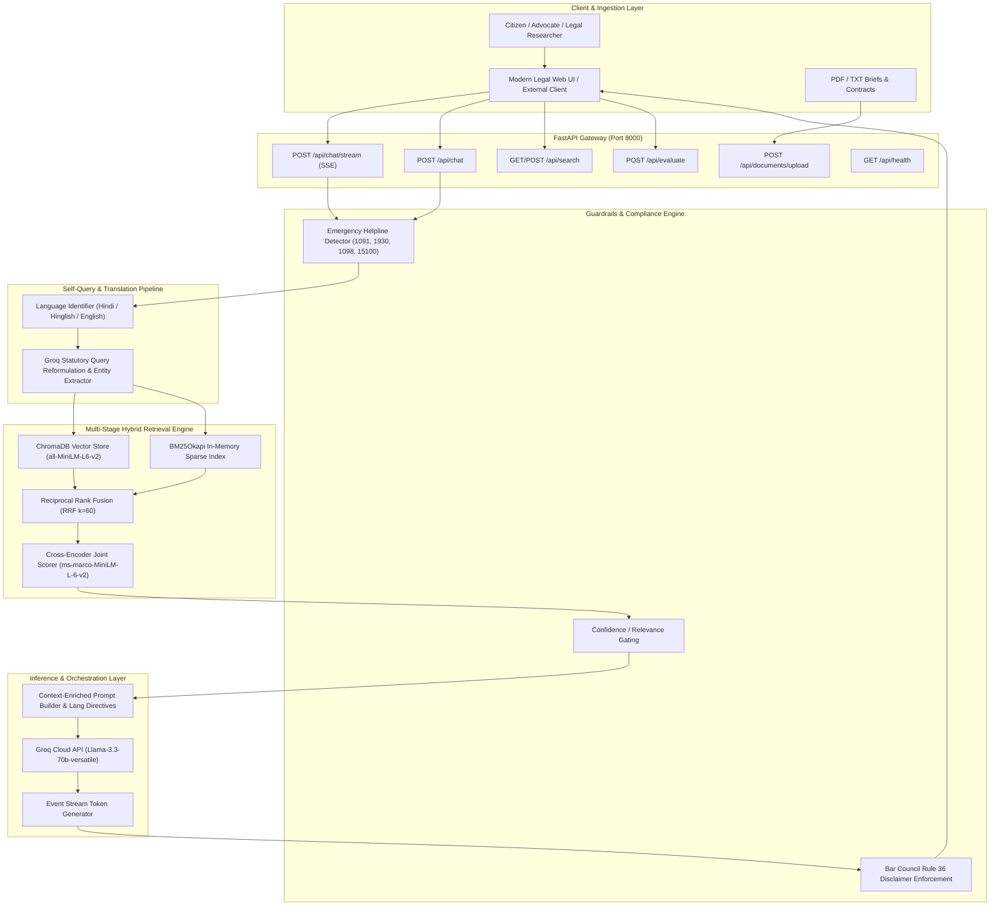

# High-Level Design (HLD): Kanoon (कानून) - AI Legal Assistant

## 1. Executive Summary & System Objectives
**Kanoon** is an enterprise-grade AI Legal Assistant and Retrieval-Augmented Generation (RAG) system tailored specifically for Indian jurisprudence, statutory compliance, and constitutional doctrine.

### Core Objectives:
1. **High Statutory Accuracy**: Zero-hallucination ground truth extraction from verified Indian legal corpora (IPC/BNS, CrPC/BNSS, CPC, Constitution, and High Court / Supreme Court precedents).
2. **Sub-Second Perceived Latency**: Real-time streaming token delivery (<300ms time-to-first-token) via Server-Sent Events (SSE) powered by Groq Llama-3.3-70B.
3. **Bar Council of India Compliance & Guardrails**: Statutory disclaimer injection, confidence-gated refusal mechanisms, and automatic emergency helpline routing (Domestic Violence 1091, Cyber Crime 1930, POCSO 1098, NALSA 15100).
4. **Indic Multi-Lingual Inclusivity**: Natural query comprehension in Hindi (Devanagari) and Hinglish (Roman script), reformulated to statutory English for retrieval, and synthesized back in the citizen's native language.
5. **Dynamic Case Brief & Contract Analysis**: On-the-fly ingestion, parsing, chunking, and dual-indexing of user-uploaded legal PDFs, petitions, and contracts.

---

## 2. High-Level Architecture Diagram

---

## 3. System Components & Functional Boundaries

### 3.1 API Gateway (FastAPI)
* **Asynchronous event loop**: Handles concurrent search, chat, streaming, and document uploads.
* **Server-Sent Events (SSE)**: Streams JSON events (`metadata`, `token`, `done`) with immediate push.
* **CORS & Lifecycle Management**: Pre-loads embeddings, warm models, and vector stores at startup.

### 3.2 Guardrails & Ethical Compliance Layer
* **Emergency Distress Detection**: Evaluates incoming queries with prioritized regex catalogs for immediate crises (domestic violence, cyber fraud, POCSO, illegal custody, suicidal ideation).
* **Confidence Gating**: Evaluates cross-encoder logits (threshold `-2.0`) and dense similarity. Unconfident queries trigger cautionary advisories rather than hallucinatory advice.
* **Bar Council of India Rule 36 & Advocates Act, 1961**: Injects non-negotiable statutory disclaimer disavowing attorney-client privilege.

### 3.3 Indic Query Reformulation (Self-Querying)
* **Script / Language Detection**: Heuristic + LLM classification of Devanagari script, romanized Hinglish, or English.
* **Statutory Translation**: Converts colloquial citizen inquiries (*"cheque bounce notice"*, *"zameen par kabza"*) into formal statutory English search queries to query the legal database effectively.

### 3.4 Multi-Stage Hybrid Retrieval Engine
* **Stage 1 (Dense Vector)**: 384-dimensional cosine similarity via ChromaDB and `all-MiniLM-L6-v2`.
* **Stage 2 (Sparse BM25)**: Exact tokenized lexical search via `rank-bm25` with legal identifier preservation.
* **Stage 3 (Reciprocal Rank Fusion)**: Harmonizes dense and sparse rankings:
  $$\text{RRF Score}(d) = \sum_{m \in \{\text{dense}, \text{sparse}\}} \frac{1}{k + r_m(d)} \quad (k=60)$$
* **Stage 4 (Cross-Encoder Re-Ranking)**: Joint attention cross-scoring using `cross-encoder/ms-marco-MiniLM-L-6-v2` over top candidates.

### 3.5 Generation & LLM Inference
* **Engine**: Groq Cloud LPUs running `llama-3.3-70b-versatile`.
* **Speed**: ~250–350 tokens per second.
* **Language Directive**: Adheres to language matching (responds in Hindi, Hinglish, or English based on input).

---

## 4. Non-Functional Requirements (NFRs)

| Metric | Target | Architecture Provision |
| :--- | :--- | :--- |
| **Time to First Token (TTFT)** | `< 350 ms` | Groq LPU streaming + lightweight local embedding inference |
| **Retrieval Recall@5** | `> 0.90` | Multi-Stage Hybrid (Dense + BM25 + Cross-Encoder) |
| **Retrieval MRR** | `> 0.85` | Reciprocal Rank Fusion & Cross-Encoder re-ranking |
| **System Availability** | `99.9%` | Resilient dual-fallback (Groq SDK -> HTTP REST) |
| **Scalability** | `100+ req/sec` | Stateless application design with persistent ChromaDB/BM25 |
| **Regulatory Compliance** | `100% compliant` | Automated Bar Council & NALSA disclaimer injection |
