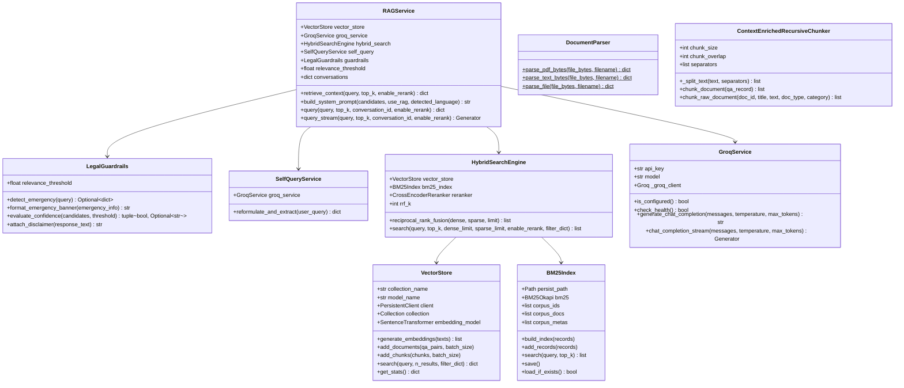
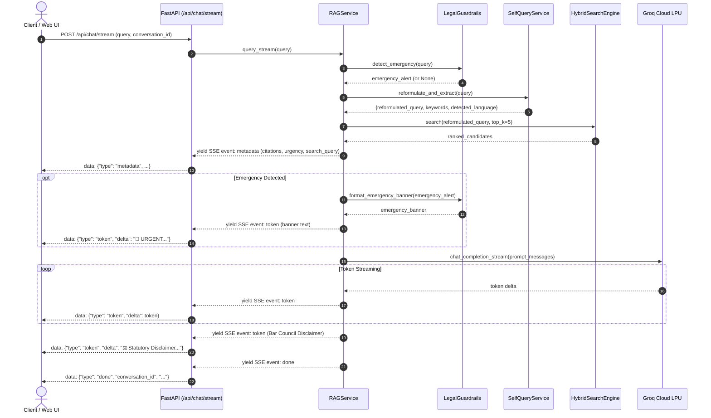
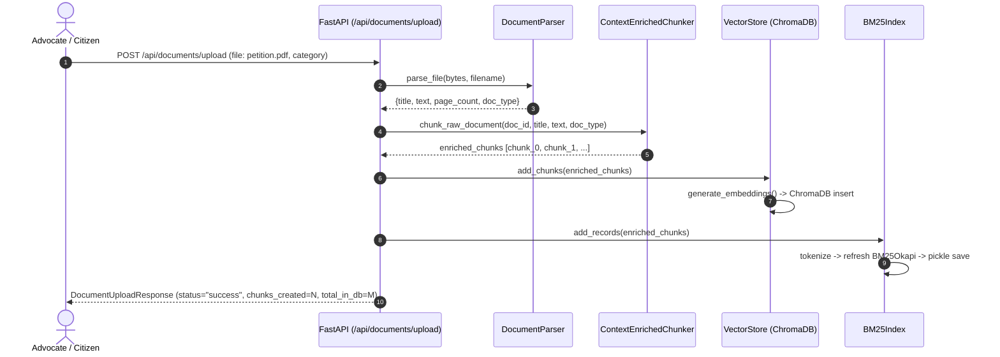

# Low-Level Design (LLD): Kanoon (कानून) - AI Legal Assistant

## 1. Class Structure & Component Hierarchy



---

## 2. Sequence Diagrams

### 2.1 Streaming Token Lifecycle (`POST /api/chat/stream`)



---

### 2.2 Dynamic Document Ingestion Lifecycle (`POST /api/documents/upload`)



---

## 3. Data Schemas & API Contracts

### 3.1 Pydantic Request & Response Models

#### `ChatRequest`
```python
class ChatRequest(BaseModel):
    query: str = Field(..., min_length=1, max_length=1000)
    conversation_id: Optional[str] = None
    top_k: Optional[int] = 5
    enable_rerank: Optional[bool] = True
```

#### `ChatResponse`
```python
class ChatResponse(BaseModel):
    response: str
    sources: List[SourceItem]
    conversation_id: str
    mode: str = "advanced_rag"
    search_query: Optional[str] = None
    similarity_score: Optional[float] = None
    emergency_alert: Optional[Dict] = None
    statutory_disclaimer: Optional[str] = None
    timestamp: str
```

#### `DocumentUploadResponse`
```python
class DocumentUploadResponse(BaseModel):
    status: str
    filename: str
    document_id: str
    title: str
    doc_type: str
    total_pages: int
    char_count: int
    chunks_created: int
    total_in_vector_db: int
    total_in_bm25: int
    timestamp: str
```

---

## 4. Error Handling & Resilience Matrix

| Failure Mode | Detection Point | Handling Strategy | User Experience |
| :--- | :--- | :--- | :--- |
| **Groq API Key Unset** | `GroqService.is_configured()` | Emits explicit configuration guidance | Warns user to set key in `.env`; retrieval still succeeds |
| **Groq Network Timeout** | `requests.exceptions.Timeout` | 60-second cutoff with graceful catch | "Response generation timed out, please retry." |
| **Corrupted PDF Upload** | `DocumentParser.parse_pdf_bytes()` | Dual parser attempt: PyPDF -> PyMuPDF (fitz) | HTTP 400 with actionable formatting detail |
| **Low Confidence Precedent** | `LegalGuardrails.evaluate_confidence()` | Cross-encoder score < -2.0 | Emits cautious non-hallucinatory guidance + NALSA helpline |
| **Out-of-Memory Embedding** | `VectorStore.add_chunks()` | Batch size fixed at 100 with progress slicing | Transparent ingestion without server crash |
